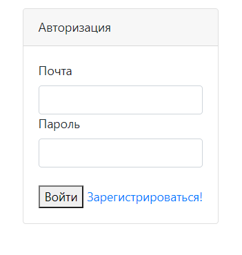
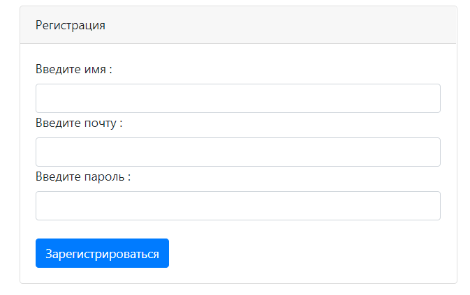

# job4j_todo
Проект список заданий из курса [job4j](https://job4j.ru/).

### Этот проект представляет веб приложение для добавления новых задач и отслеживание их выполнения .

#### Функциональность:

- Возможность создавать задачи и отмечать их статус завершения
- Можно отображать на странице только невыполненные, так и уже выполненные задания

#### Используемые технологии:

- PostgreSQL 13.2

- ORM Hibernate 5.4

- Servlet API 4.0.1

- Javascript, Bootstrap 3.3.7

- AJAX 3.3.1

#### В проекте есть авторизация и регистрация:

*Пользователи сохраняются в БД PostgreSQL*

#### Авторизация пользователя

#### Регистрация пользователя
