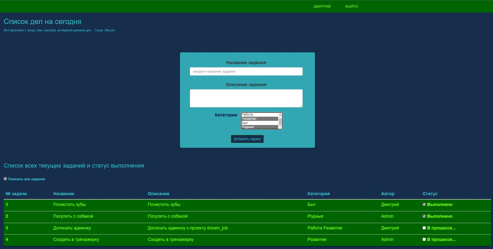

# job4j_todo
Проект список заданий из курса [job4j](https://job4j.ru/).

### Этот проект представляет веб приложение для добавления новых задач и отслеживание их выполнения .

#### Функциональность:

- CRUD операции для заданий

- Удобный веб интерфейс

#### Используемые технологии:

- ORM Hibernate для работы с БД

- Servlet API для управления бизнес-логикой

- Javascript, Jquery, AJAX для отображения заданий